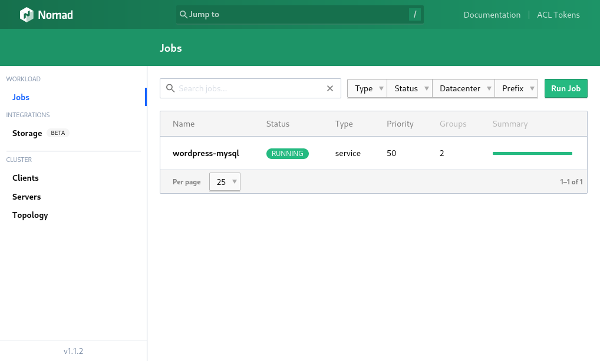
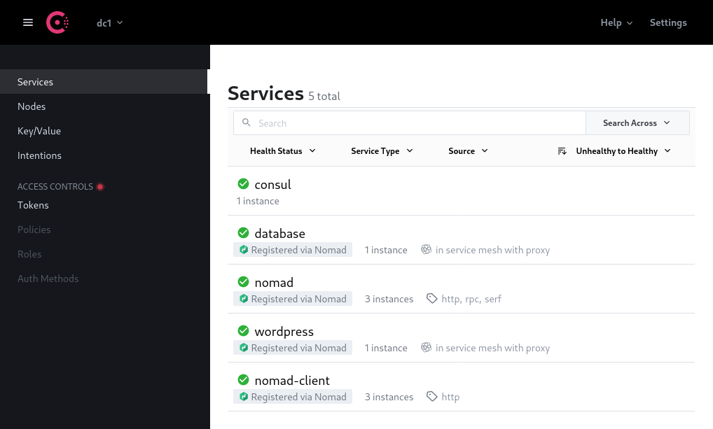

# HashiCorp Vagrant Lab

This *Vagrantfile* deploys some of [HashiCorp](https://www.hashicorp.com/)'s products and simulates a small cloud infrastructure in a virtualized environment with Vagrant. This includes [Nomad](https://www.nomadproject.io/), [Consul](https://www.consul.io/) and [Vault](https://www.consul.io/).

| [Nomad dashboard](http://192.168.56.10:4646/ui) | [Consul dashboard](http://192.168.56.10:8500/ui) |
| :---------------------------------------------: | :----------------------------------------------: |
|                           |                           |

## Getting started

**Prerequisite**: The latest versions of [Vagrant](https://www.vagrantup.com/) and [VirtualBox](https://www.virtualbox.org/) must be installed on your machine.

Feel free to change the VM's specs in the `Vagrantfile` on lines 9 to 11 before launching them. You can also add or remove nodes by adding or removing lines in the `NODES` array.

```shell
git clone https://github.com/balsigergil/hashicorp-vagrant-lab.git
cd hashicorp-vagrant-lab
vagrant up
```

## What's in the box

This Vagrantfile deploys the following services on 3 virtual machines :

- 1 Consul server (VM 1) : [http://192.168.56.10:8500/ui](http://192.168.56.10:8500/ui)
- 1 Nomad server (VM 1) : [http://192.168.56.10:4646/ui](http://192.168.56.10:4646/ui)
- 1 Vault server (VM 1) : [http://192.168.56.10:8200/ui](http://192.168.56.10:8200/ui)
- 3 Nomad clients (VM 1, 2 and 3) : 192.168.56.10, 192.168.56.11, 192.168.56.12

**Note**: The Nomad server is a Nomad client too.

It uses [Ansible](https://docs.ansible.com/ansible/latest/index.html) to provision all machines.
